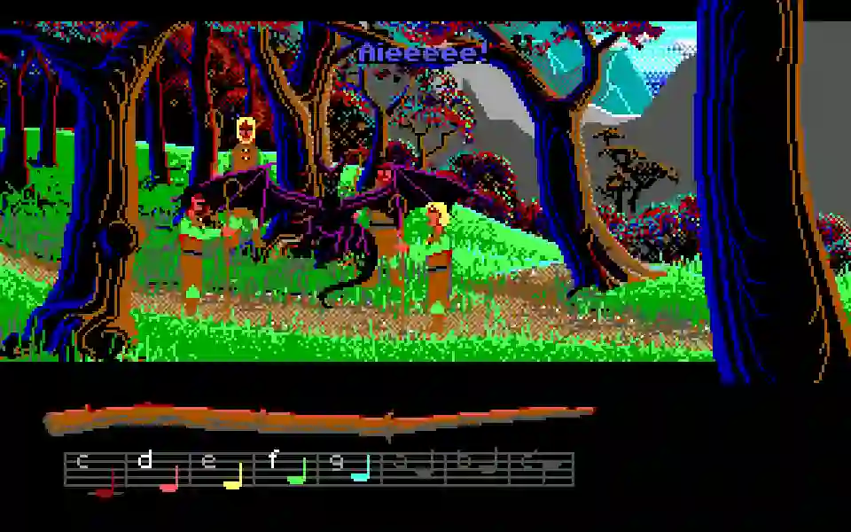
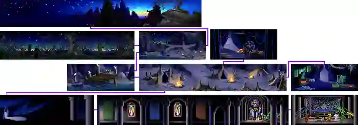
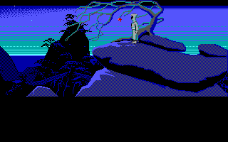

# Loom: El arte de tejer hechizos con el oído.

    

Hace pocos días me decidí a dar vuelta (sí, todavía se dice así) un juego que tenía hacía meses guardado, pero que conozco hace más de 15 años. Estoy hablando de Loom (Telar, en español). A menos que tengas casi 50 años o más, es imposible que conozcas esta aventura gráfica… Salvo que, como yo, hayas visto la propaganda del juego en otro gran juego llamado Monkey Island 1.

    

    <i>"Ask me about Loom", el mítico easter egg en Monkey Island.</i>

Decidí saldar esa antigua deuda conmigo mismo, ya que el rey de las aventuras gráficas fue, es y siempre será Lucas Arts. Y dado que Jorgito Lucas le vendió el alma al ratón monopólico, tenemos por asegurado que jamás volverá esa época dorada donde lo único que tenías era la magia de probar todo con todo hasta ir avanzando a las patadas. Método científico puro, señores. Por ello, hay que sacarle jugo a todas las joyas del pasado. Las excelentes y las sólo buenas. Ahí es donde entra el juego de hoy.

Resulta que alguna vez había leído que existía un juego de Lucas Arts que era diferente; especial. Pero nunca investigué por qué. Y cuando hace unos meses le di la primer probada, me acordé que era este.

    

Lo que hace distinto a este juego es que, a diferencia de aventuras anteriores y posteriores, en Loom las acciones se realizan con el oído. Teniendo una varita mágica musical, tocamos secuencias de notas en escala americana/yanqui, hasta conseguir 4 notas. Yo, confiado de mi experiencia en juegos previos, me tiré de una a la dificultad más alta… Sin sospechar que en tal caso, tenés que aprenderte los patrones sin mirar, y sin ningún tipo de ayuda más que tu oído.

Naturalmente, lo único que pude hacer fue caminar y caminar sin lograr casi nada, hasta que lo saqué y nunca más lo toqué hasta hace una semana. Habiendo aprendido la lección, decidí jugar en fácil e ir avanzando con el ya nombrado “todo con todo”. Ahí es donde salta enseguida a la vista otra característica de este juego, que está presente en todos los de la época (fines de los 80), y es que tenías dos escuelas de pensamiento: juegos de avance lento y crípticos (Castlevania 2 de Family/NES; Monkey Island; Juegos de laberintos, con llaves que podían trabarte por horas si no las encontrabas), y juegos rápidos pero difíciles, si es que tenían final (Battletoads; Sagas Mario/Sonic; juegos arcade en gral). La premisa era la misma: el juego tiene que durar. Esa sería la ley hasta la popularización de los CDs como formato de distribución, ya que el avance en computadoras permitió la piratería, y por lo tanto, la masificación de los juegos en sí (al menos en nuestra región).

Volviendo un poco, Loom demuestra ser un hijo de su época. Es un juego lento, y lo expresa en la forma de caminar del personaje; en la imposibilidad de saltearse escenas y varias acciones, como es la propia conjuración de hechizos (o sea, ir probando las posibilidades en el “todo con todo”). Sin embargo, a pesar de su lentitud agobiante, el juego es bello. Y no sólo por ser distinto a Indiana Jones; Monkey Island o Maniac Mansion (por nombrar algunos de sus hermanos cercanos en fecha), si no porque toda la ambientación te tira a seguir probando “una vez más” antes de dejar.

    

Considero bastante importante el hecho de escuchar (o leer) el trasfondo de la historia del protagonista, antes de jugar. Ya que, nuevamente, como buen hijo de su época, este juego traía un cassette con la caja, y seguramente debe haber mucha gente que actualmente se pasa la aventura y luego descubre la existencia del audio drama. Para facilitar las cosas, al final de la nota voy a dejar los enlaces a la versión traducida de la transcripción del cassette, y algún que otro enlace importante que leí antes y después de haberlo terminado.

La historia trata sobre Bobbin, el hijo prohibido de un grupo de humanos mágicos llamado el “gremio de los tejedores”. Previendo un colapso social inminente, vaticinado por la presencia del protagonista, y por las predicciones del telar mágico, los ancianos tejedores abandonan la seguridad de la isla donde residían, llevándose a toda la tribu y dejando solo a Bobbin, que acaba de cumplir 17 años y está viendo sus poderes florecer. Recorreremos entonces las tierras de los tejedores y 3 tribus más, buscando una explicación a por qué nuestra tribu no nos quiere; qué es lo que prevé el telar que ocurrirá y cuál es nuestro destino en el mundo mágico donde vivimos.

    

Para cerrar, y resumiendo un poco lo que me pareció:

- Es críptico: Se nota mucho que es un juego lento y hecho para personas de hace varias décadas. Algunas cosas se pueden pensar rápido pero hay muy pocas pistas sobre cómo avanzar sin caer en la prueba y el error constante (y lento).
- Es bello: Tomando en cuenta que está por cumplir 40 años, el apartado artístico es excelente. La música, al parecer del [lago de los cisnes (Tchaikovski)](https://www.youtube.com/watch?v=6uHhwkWBzdM), ambienta perfectamente toda la aventura (al parecer hay versiones que no tenían mucho espacio para la música constantemente, así que fijarse qué versión se juega). Es lo suficientemente bonito como para compensar el punto anterior en casi todo momento.
- Es corto: sin arruinar el final, el juego se termina en un par de horas, y tiene final abierto. Esto es porque estaba hecho para tener continuación, pero nunca la tuvo oficialmente. Al parecer quedó como un juego muy querido pero de nicho, por tener pocas ventas.

## Entonces ¿Vale la pena jugarlo?

Sí, totalmente. No lo recomiendo ni loco como primera aventura gráfica, o segunda, o tercera. Tampoco hace falta ser un experto para entender todo, pero hay que tenerle paciencia al menos hasta dominar los hechizos necesarios para salir de las pantallas iniciales. Su nivel de dificultad era mediano tirando a bajo, para el público de cuando salió, pero hoy es mediano tirando a alto, dado que han cambiado mucho los hábitos de juego y la paciencia del jugador para los soft-locks (que por suerte no tiene, pero pareciera todo el tiempo que sí). Entonces, no se lo recomendaría a nadie de menos de 20 años, salvo que supiera que dicha persona tiene bastante capacidad deductiva, producto de entrenarse con juegos de lógica e ingenio (que son habilidades usadas en TODAS las aventuras gráficas; no sólo en esta).

Y así concluye esta experiencia con Loom. Otro juego dado vuelta; otra vuelta a la nada mágica realidad en la que vivimos. Hasta la próxima.

## Referencias

[Audio Drama Loom Español](http://www.mediafire.com/file/80a7j6l0fqur1sy/Audio+Drama+Loom+Espa%25C3%25B1ol.pdf)
[Delac Aventuras - Loom](https://www.delac.es/juegos/juego.php?id=loom)
